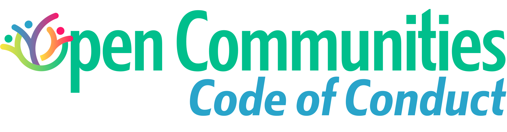

# Open Communities



A collaborative effort to define and maintain standards that make open-source projects and communities truly *open*, **inclusive**, and **respectful**.

Our initial focus is a comprehensive Code of Conduct, but this repository is intended to grow with additional guidelines, tools, and resources that support healthy open communities.

## 📌 About this Project

- Provide a clear, friendly, and actionable Code of Conduct for community projects.
- Offer guidance and templates for community managers and contributors.
- Empower projects to adopt inclusive practices through shared standards.

## 📄 Code of Conduct

The core document for this repository is the [Code of Conduct](./CODE_OF_CONDUCT.md). It outlines our expectations for behavior and serves as the foundation for a welcoming environment.

## 🛠️ Project Structure

```
assets/
  badge.svg          # badge for other repos to display
  code-of-conduct.svg # project logo
CODE_OF_CONDUCT.md   # primary code of conduct document
README.md            # this overview file
```

## 🏷️ Badge

Show that your project follows the Open Communities Code of Conduct by adding this badge to your README:

[](https://github.com/UniquePixels/OpenCommunities)

**Markdown:**

```markdown
[](https://github.com/UniquePixels/OpenCommunities)
```

**HTML:**

```html
<a href="https://github.com/UniquePixels/OpenCommunities">
  
</a>
```

## 🤝 Contributing

Contributions are welcome! Whether you're proposing enhancements to the Code of Conduct, suggesting new community standards, or providing implementation guidance, please open a pull request or issue.

Every voice matters – let's build something inclusive together.

---

## 📚 Inspiration & Sources

This Code of Conduct was inspired by and borrows language from several established projects and policies:

- https://www.postgresql.org/about/policies/coc/
- https://www.ruby-lang.org/en/conduct/
- https://github.com/rust-lang/prev.rust-lang.org/blob/master/en-US/conduct.md
- https://microsoft.github.io/codeofconduct/
- https://www.contributor-covenant.com/

---

*Created with ❤️ for open and welcoming communities.*
